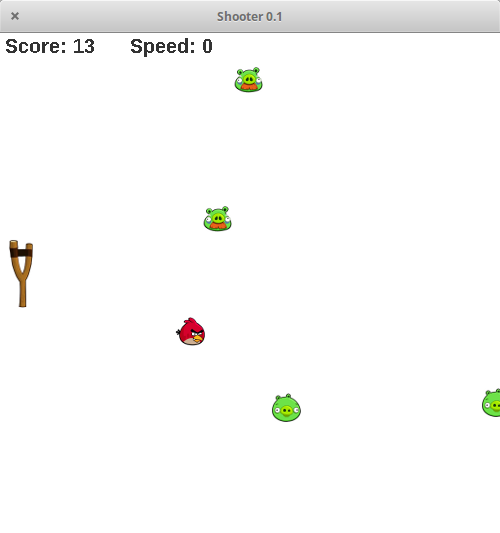

# MVC Shooter

School project shooting GUI game inspired by Angry birds.
Demonstration of design patterns.

## Build

Application is based on maven tool. You can package fat JAR with dependencies:

`mvn clean compile assembly:single`

JAR can be executed using command:

`java -jar build.jar`

## Controls

* KEY UP - move cannon up
* KEY DOWN - move cannon down
* R - switch to realistic mode of missile
* S - switch to simple mode of missile
* KEY BACKSPACE - load last saved state
* KEY SWITCH - switch cannon mode (single / double shooting)
